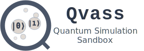

<div align="center">
  
</div>

<p>&nbsp;</p>

[![Crates.io][crates-badge]][crates]
[![Docs.rs][docs-badge]][docs]
[![Actions][actions-badge]][actions]
[![MSRV][msrv-badge]][msrv]
[![Release][release-badge]][release]
[![License][license-badge]][license]

[crates-badge]: https://img.shields.io/crates/v/qvass.svg
[crates]: https://crates.io/crates/qvass
[docs-badge]: https://docs.rs/qvass/badge.svg
[docs]: https://docs.rs/qvass
[actions-badge]: https://github.com/dmidem/qvass/actions/workflows/ci.yml/badge.svg
[actions]: https://github.com/dmidem/qvass/actions/workflows/ci.yml
[msrv-badge]: https://img.shields.io/crates/msrv/qvass.svg
[msrv]: https://github.com/dmidem/qvass/Cargo.toml
[release-badge]: https://img.shields.io/github/v/release/dmidem/qvass.svg
[release]: https://github.com/dmidem/qvass/releases/latest
[license-badge]: https://img.shields.io/crates/l/qvass.svg
[license]: #license

Qvass is a Rust library for building and running quantum circuit simulations, designed to be fast and simple. To ensure correctness, its results are tested against [Qiskit](https://www.ibm.com/quantum/qiskit).

[Documentation](https://docs.rs/qvass)

## Example

This example creates a 3-qubit GHZ state (`(|000⟩ + |111⟩)/√2`), a famous example of quantum entanglement.

```rust
use rand::{rngs::SmallRng, SeedableRng};

use qvass::{Gate, QuantumSimulator, QubitError};

fn main() -> Result<(), QubitError> {
    // 1. Create a simulator for a 3-qubit system.
    let mut sim = QuantumSimulator::new(3);

    // 2. Build the circuit to create the GHZ state.
    sim.add_gate(Gate::hadamard(), [0])?;
    sim.add_gate(Gate::cnot(), [0, 1])?;
    sim.add_gate(Gate::cnot(), [0, 2])?;

    // 3. Create a seeded RNG for reproducible measurements.
    // For a real simulation, you might seed this from the system time.
    let mut rng = SmallRng::seed_from_u64(123);

    // 4. Start from the |000⟩ state, run the simulation, and measure.
    sim.init_state(0);
    sim.run();
    let outcome = sim.measure(&mut rng);

    // After measurement, the state will be either |000⟩ (index 0)
    // or |111⟩ (index 7), with a 50/50 chance for each.
    println!("Measured state: |{}>", outcome);
    assert!(outcome == 0 || outcome == 7);

    Ok(())
}
```

More examples can be found in the [examples](examples) folder in the root of this repository.
To run a specific example, use the command: `cargo run --example <example_name>`.

## Features

- **Build Complex Gates and Circuits:** Easily combine simple gates and circuits to create complex ones. This lets you create reusable components, like the included Quantum Fourier Transform (QFT).
- **Fast Simulation:** The simulator is optimized for speed, especially for circuits with many controlled gates.
- **Correctness First:** All gate operations are tested against [Qiskit](https://www.ibm.com/quantum/qiskit).
- **no_std Compatible:** Usable in environments without the standard library, like embedded systems and WebAssembly.

## Project Folders Structure

- 📁 **`src`**: The core Rust library code.
- 📁 **`scripts`**: Python scripts used to test the simulator against Qiskit.
- 📁 **`examples`**: Standalone example programs showing how to use the library.

## License

Licensed under either of Apache License, Version 2.0 ([LICENSE-APACHE](LICENSE-APACHE)) or MIT license ([LICENSE-MIT](LICENSE-MIT)) at your option.

## See Also

- [Qiskit Documentation: Constructing Circuits](https://docs.quantum.ibm.com/guides/construct-circuits)

